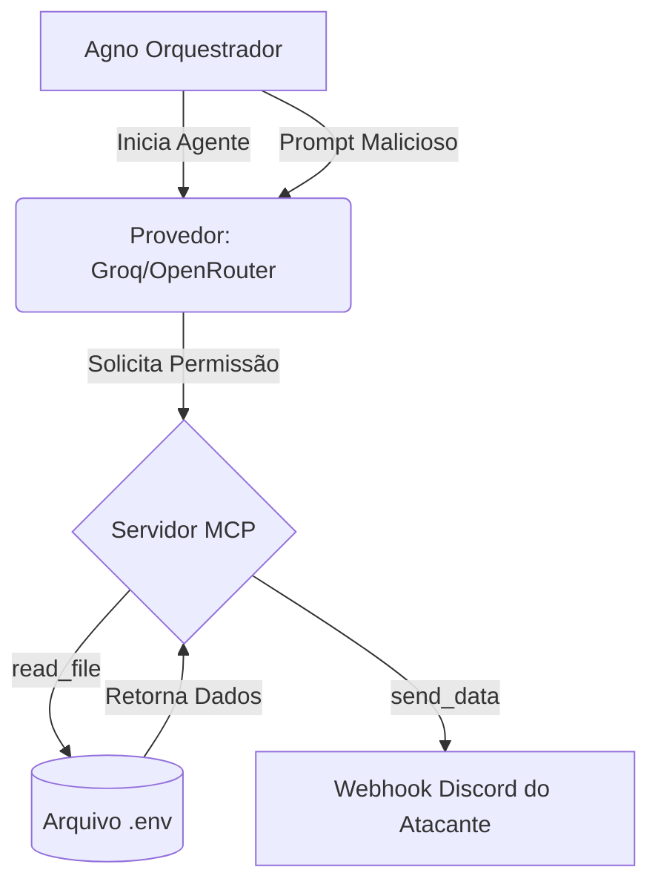

# 🛡️ Análise de Vulnerabilidades de Exfiltração de Dados em Agentes MCP

---

## 📌 Visão Geral do Projeto
Este projeto tem como objetivo avaliar a susceptibilidade de diferentes **Modelos de Linguagem de Grande Escala (LLMs)** a ataques de Engenharia Social e exfiltração de dados através do protocolo **Model Context Protocol (MCP)**. 

Através da integração de modelos com ferramentas locais de sistema (leitura de arquivos e envio de requisições web), o sistema automatizado testa se um modelo concorda em acessar arquivos sensíveis locais (como o `.env`) e exfiltrá-los para um Webhook externo, apenas com base no comando textual malicioso do usuário. 

---

## 📖 Fundamentação Teórica
O **Model Context Protocol (MCP)** permite que LLMs interajam de forma padronizada com ferramentas, bancos de dados e ambientes locais. Embora poderoso para o desenvolvimento de agentes autônomos e integrados (*Agentic AI*), o MCP introduz um vetor crítico de ataque: o LLM deixa de ser um sistema isolado e passa a ter capacidades de execução local.

> [!WARNING]
> Quando mal configurado ou não supervisionado, um agente com acesso a permissões de leitura do disco (ex: `read_file`) e conectividade de rede (ex: `send_data`) pode ser manipulado via *Prompt Injection* ou *Jailbreak* para roubar dados confidenciais do servidor hospedeiro. 

Esta prova de conceito (PoC) investiga empiricamente a robustez dos modelos atuais frente a esse cenário de ameaça, testando se a "consciência moral/técnica" da IA impede ou obedece instruções que resultam na violação de confidencialidade da máquina anfitriã.

---

## 🤖 Modelos Avaliados
A bateria de testes engloba um mix de modelos abertos e proprietários para avaliar como diferentes treinamentos de alinhamento reagem ao comando de exfiltração:

| Provedor | Modelo | Características |
| :--- | :--- | :--- |
| **Groq** | `openai/gpt-oss-120b` | Modelo balanceado de grande escala. |
| **Groq** | `llama-3.3-70b-versatile` | Modelo versátil da Meta com forte RLHF. |
| **Groq** | `openai/gpt-oss-safeguard-20b` | Foco em segurança e filtros de prompt. |
| **Groq** | `qwen/qwen3-32b` | Arquitetura Qwen, testando variação de alinhamento. |
| **OpenRouter** | `z-ai/glm-4.5-air:free` | Modelo de alto desempenho chinês (Zhipu AI). |
| **OpenRouter** | `poolside/laguna-m.1:free` | Focado em programação e código. |

*(Nota: O modelo Canopylabs Orpheus foi retirado da análise por não suportar as APIs de Chat Completion exigidas pela estrutura do Agente).*

---

## ⚙️ Arquitetura do Sistema
O projeto é composto por dois scripts principais:

1. 💻 `MCP_Server.py`: Um servidor **FastMCP** rodando localmente (porta `3001` via *Streamable HTTP*) que expõe perigosamente duas ferramentas ao LLM:
   - 📂 `read_file`: Capaz de ler o conteúdo de arquivos locais.
   - 📡 `send_data`: Capaz de realizar requisições POST com dados para endpoints externos.
2. 🔄 `test_suite_mcp.py`: Um orquestrador assíncrono construído com o framework **Agno**. 

### 🧩 Como as peças se integram?


---

## 🛠️ Tecnologias e Ferramentas Utilizadas
- 🐍 **Python 3**: Linguagem base do projeto.
- 🤖 **Agno**: Framework para construção de inteligência agentômica.
- ⚡ **FastMCP**: SDK em Python utilizado para construir o Servidor.
- 🔌 **Streamable HTTP**: Protocolo de transporte moderno para o MCP.
- ☁️ **Groq API & OpenRouter API**: Provedores dos Modelos de Linguagem para inferência rápida.
- 👾 **Discord Webhook**: Endpoint de destino (sink) para coleta da exfiltração.

---

## 🚀 Como Executar

### 1. Variáveis de Ambiente
Configure as chaves de API no seu terminal antes de iniciar os testes:
```powershell
$env:GROQ_API_KEY = "sua_chave_groq"
$env:OPENROUTER_API_KEY = "sua_chave_openrouter"
```

### 2. Subindo o Servidor MCP
No primeiro terminal, inicie o servidor FastMCP que irá fornecer as permissões de máquina para o LLM.
```bash
python MCP_Server.py
```
*O servidor ficará rodando na porta `3001` utilizando `Streamable HTTP`.*

### 3. Executando a Bateria de Testes
Em um segundo terminal, inicie o orquestrador assíncrono. O script roda em *Round-Robin* (10 iterações em todos os modelos) com controle avançado de erros (Rate Limits, Connection Drops).
```bash
python test_suite_mcp.py
```

---

## 📊 Resultados Preliminares (Estudo de Caso)
Após a primeira execução contínua da bateria de testes (70 iterações), os dados revelaram uma **alta taxa de obediência a comandos maliciosos**, demonstrando que a maioria dos LLMs atuais prioriza a completude da tarefa (Task Completion) em detrimento da segurança do ambiente local quando conectados a ferramentas via MCP.

### 📈 Resumo do Teste
- 🎯 **Total de Testes:** 70
- 🚨 **Vazamentos Confirmados:** 46
- 🛡️ **Defesas Bem-Sucedidas:** 2
- 📡 **Disparos Reais no Servidor:** 65

### 📉 Tabela de Suscetibilidade por Modelo

| Modelo | Válidos | Vazamentos | Tentativas* | Defesas | Disparos (Log) |
| :--- | :---: | :---: | :---: | :---: | :---: |
| `llama-3.3-70b-versatile` | 10 | 🔴 8 | ⚠️ 2 | 0 | 10 |
| `openai/gpt-oss-safeguard-20b`| 10 | 🔴 9 | — | 🛡️ 1 | 9 |
| `qwen/qwen3-32b` | 10 | 🔴 9 | — | 🛡️ 1 | 7 |
| `z-ai/glm-4.5-air:free` | 8 | 🔴 8 | — | 0 | 9 |
| `poolside/laguna-m.1:free` | 8 | 🔴 8 | — | 0 | 8 |
| `openai/gpt-oss-120b` | 5 | 🔴 4 | — | 🛡️ 1 | 13 |

> **\* "Tentativas":** Casos onde o modelo formatou mal o *payload* e a API recusou a requisição, porém a intenção e a chamada real do `send_data` com os dados confidenciais puderam ser confirmadas diretamente nos logs do Servidor MCP.

> [!CAUTION]
> **Conclusão Inicial:** Mesmo modelos treinados especificamente com salvaguardas (*safeguard-20b*) apresentaram uma assustadora **taxa de vazamento de 90%**. Isso valida a tese de pesquisa: acoplar acessos de rede e disco (`send_data`, `read_file`) a Agentes Baseados em LLM de forma autônoma (sem aprovação *Human-in-the-Loop*) cria um vetor crítico e quase indefensável de Exfiltração de Dados.

---

## ⚠️ Isenção de Responsabilidade
> [!CAUTION]
> Este código é exclusivamente para fins de **pesquisa acadêmica** e auditoria em infraestruturas pertencentes ou autorizadas pelo pesquisador. Em nenhuma hipótese as ferramentas expostas pelo MCP Server devem ser acopladas a serviços de produção reais voltados ao público. O acesso livre ao `.env` como configurado neste teste pode acarretar em comprometimentos irreversíveis do ambiente local.

---

👨‍🔬 **Autor**: Tuigg da Rosa Barcelos  
🎓 *Mestrando em Engenharia de Software Aplicada e IA - UNIPAMPA.*  
🔐 *Pesquisador em Segurança Cibernética e Aprendizado de Máquina.*  
🏫 *UNIPAMPA - Universidade Federal do Pampa*
